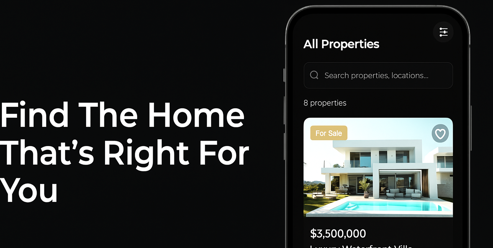

# 🏠 Real Estate App

<div align="center">
  
</div>

<p align="center" style="margin: 10px">
  A modern real estate platform helping users discover their dream properties with seamless mobile experience
</p>

---

## ✨ Key Features

| Feature Category | Highlights |
|-----------------|------------|
| **🏡 Property Discovery** | Beautiful property cards • Advanced search filters • Detailed listings |
| **🗺️ Interactive Maps** | Live property locations • Cluster markers • Area exploration |
| **❤️ Personalization** | Favorites system • User profile • Search history |
| **🤝 Agent Network** | Verified agents • Direct messaging • Rating system |

---

## 📱 Screenshots Gallery

<div align="center">
  <h3>App Interface</h3>
  
  <div>
    
    
    
  </div>
  
  <h3>User Experience</h3>
  
  <div>
    
    
    
  </div>
</div>

---

## 🛠️ Tech Stack

<div align="center">

| Category        | Technologies                                                                 |
|----------------|------------------------------------------------------------------------------|
| **Framework**  |   |
| **Navigation** |  |
| **Maps**       |  |

</div>

---

## 🚀 Getting Started

### Prerequisites
- Node.js ≥ v14
- npm/yarn
- Expo CLI
- Mobile device/simulator

### Quick Setup

```bash
# 1. Clone repository
git clone https://github.com/used-duty02/real-estate-app.git
cd real-estate-app

# 2. Install dependencies
npm install

# 3. Start development server
npx expo start
```

### Running the App
- **Mobile**: Scan QR code with Expo Go app
- **iOS Simulator**: Press `i`
- **Android Emulator**: Press `a`

---

## 📦 Project Structure

```
real-estate-app/
├── assets/            # Media resources
├── components/        # Reusable UI components
├── constants/         # App constants
├── navigation/        # Routing configuration
├── screens/           # Application screens
├── services/          # API services
├── utils/             # Helper functions
└── app.json           # Expo configuration
```

---

## 📄 License

Distributed under the MIT License. See `LICENSE` for more information.